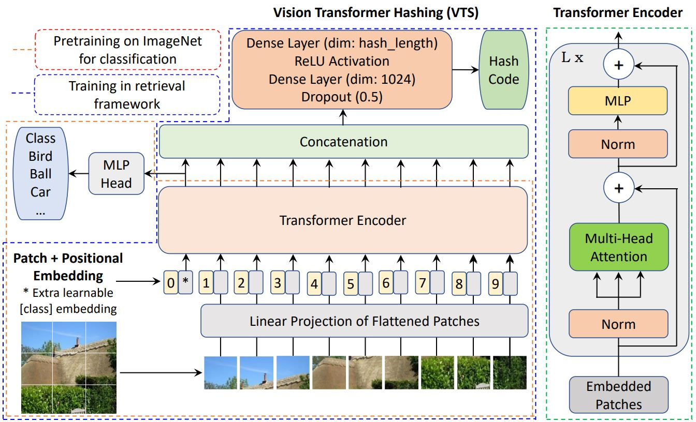

# Vision Transformer Hashing (VTS), IEEE ICME 2022 - Pytorch
[[arXiv Preprint]](https://arxiv.org/abs/2109.12564)

Vision Transformer Hashing (VTS) utilizes the Vision Transformer to generate the hash code for image retrieval. 
It is tested under different retrieval frameworks such as DSH, HashNet, GreedyHash, IDHN, CSQ and DPN.

## How to Run

This code uses the Vision Transformer (ViT) code and pretrained model (https://github.com/jeonsworld/ViT-pytorch) and DeepHash framework (https://github.com/swuxyj/DeepHash-pytorch).

Download the ViT pretrained models from official repository and keep under pretrainedVIT directory:

ViT-B_16: https://storage.googleapis.com/vit_models/imagenet21k/ViT-B_16.npz 

ViT-B_32: https://storage.googleapis.com/vit_models/imagenet21k/ViT-B_32.npz

Download data from https://github.com/swuxyj/DeepHash-pytorch for different dataset, if not already present under data directory.

Run notebook main.ipynb by setting the path. You can also directly run the corresponding file such as, 

python DSH.py

python CSQ.py

python DPN.py

Select the backbone such as AlexNet, ResNet, ViT-16 or ViT-32 before running.

### Paper Citation
Please cite following paper if you make use of this code in your research:

Shiv Ram Dubey, Satish Kumar Singh, and Wei-Ta Chu. Vision Transformer Hashing for Image Retrieval. IEEE International Conference on Multimedia and Expo (ICME), July 2022.
